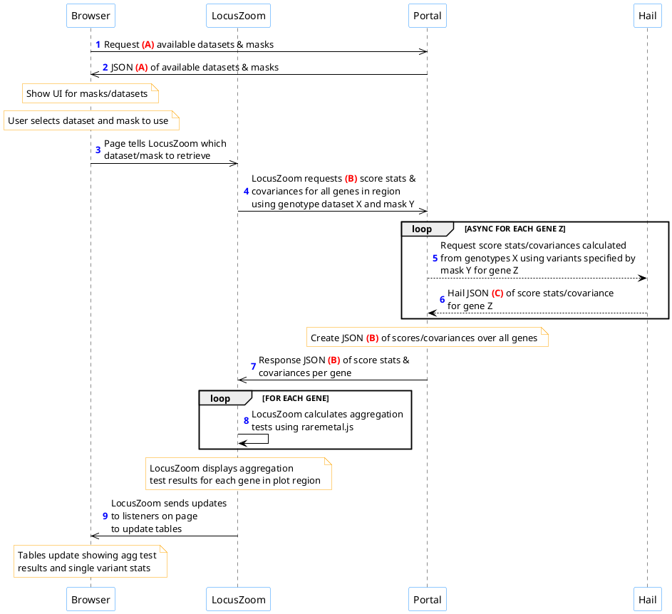

# Aggregation tests on the portal

## Outline

An outline of the process is below.

Request and response JSON formats:

* Request and response format A are under "**Retrieve available datasets/masks**" in the raremetal.js [proposal].
* Request and response format B are under "**Retrieve covariance in region given dataset/mask**" in the raremetal.js [proposal].
* HAIL JSON format C can be found [in this PDF](https://gist.github.com/welchr/74e36d365ddc0b1095db68e43d4b0bdd#file-restserverspec-pdf).

## Proposed implementation targets

This is an initial proposal for discussion; dates are open to revision based on grant and portal priorities.

Performing aggregation tests requires coordination between the portal front-end (UI), back-end (server), and a data/ calculation provider (HAIL). The relevant tasks are divided into sections accordingly.

We recognize that coordinating among multiple teams adds complexity to a schedule. Each section provides  (optional) suggestions on how to generate mock data that other teams can use for development, until the final deliverable is ready.

### HAIL
HAIL has basic functionality for covariance matrix calculations, but aggregation tests will require exposing certain additional information:

- [ ] Return **allele frequencies** in response (preferably ALT allele frequency).
- [ ] Return **single variant p-values** in response.
- [ ] Any additional development work that may be required (e.g. merging REST server code into master).

#### Portal datasets in HAIL
Some work may be needed to expose the relevant Portal datasets to HAIL.

- [ ] **Convert all genotype datasets to HAIL VDS format.** HAIL requires a specific format for genotype data, which is used to calculate covariance matrices.
- [ ] **Expose datasets to the portal covariance API**. *2018-XX-XX*

#### (optional) Process for generating mock HAIL response
- Generate a sample JSON file with calculated covariance information in HAIL format. This can be loaded by the Portal backend to support development of the mask --> covariance endpoint.

### T2D Portal (Backend)
The portal backend will be responsible for identifying and retrieving data used by the calculations.

- [ ] **Generate masks / filter sets for genotype datasets.** Could start with a few simple masks to begin with. Should ask Mike/Goncalo/Jason what would make sense for this. *2018-XX-XX*

- [ ] **Implement portal metadata API**. (*steps 1-2 in diagram*) Tells the browser which genotype datasets are available to compute from, and what masks/filters are defined for each. See [metadata API proposal](https://github.com/statgen/raremetal.js/blob/master/src/docs/portal-api.md#request). *2018-XX-XX*

- [ ] **Implement Portal covariance API.** (*steps 4-7 in diagram*) This is likely the rate limiting step and most difficult to accomplish, and it also requires HAIL completing [additional features](#hail). *2018-XX-XX*

#### Stretch goal
In the first phase, the user would only select pre-defined groups of variants. We refer to these as "masks" (specific sets of variants), or "filters" (criteria that could be used to produce that set of variants on the fly). For example: "Protein truncating variants in a gene, with AF < 0.05".

Using pre-defined masks would ease the burden of UI development to ensure initial delivery of a useful tool.

Eventually the backend should look to support requesting covariance data based on an arbitrary user-defined mask (defined as either a list of variants, OR a set of filters that could produce that list of variants). This stretch goal would enable truly free-form exploratory analysis.

#### (optional) Create a mock portal covariance API
- [ ] **Select a trial genotype dataset/VCF and generate masks for it.** (*steps 1-2 in diagram*) Generate a sample JSON file with lists of known masks for a region. See [metadata API format proposal](https://github.com/statgen/raremetal.js/blob/master/src/docs/portal-api.md#request) for sample. This would allow UI work to proceed before the metadata endpoint is implemented. *2018-XX-XX*

- [ ] **Generate mock covariance data for one region.** (*steps 4-7 in diagram*) Generate a sample JSON file with score and covariance data. See [covariance API format proposal](https://github.com/statgen/raremetal.js/blob/master/src/docs/portal-api.md#request-1). This would allow UI work to proceed before HAIL is implemented. *2018-XX-XX*

### T2D Portal (UI)
The UI is responsible for selecting (or defining) groups of variants that will be used as input to an aggregation test. Once a "mask" is defined, LocusZoom will request either covariance data OR final calculation results from the server, and apply them as a visualization.

- [ ] **Implement UI for selecting pre-defined datasets/masks on portal page**. To start with, this UI could potentially be copied from the [aggregation test demo](http://statgen.github.io/locuszoom/examples/aggregation_tests.html). *2018-XX-XX*

#### Stretch goal
- [ ] **Implement UI for user-defined arbitrary masks/filters.** (*steps 1-3 of diagram*) The Portal has a [variant finder UI](http://www.type2diabetesgenetics.org/variantSearch/variantSearchWF) that may be useful for inspiration. This would be done in conjunction with support for this feature on the Portal backend.

### LocusZoom.js team
An initial implementation of aggregation tests is complete; see [aggregation test demo](http://statgen.github.io/locuszoom/examples/aggregation_tests.html). That demonstration works exclusively on mock data.

- [ ] **Support final API and visualization preferences**. The scope of this task is to make changes to LocusZoom and raremetal.js, as required to support the final integration. *2018-XX-XX*

### Integration
- [ ] **Prototype available on portal test site.** *2018-XX-XX*
- [ ] **Testing and user feedback.** *2018-XX-XX*
- [ ] **Deploy to production.** *2018-XX-XX*

## Build this document

Grab [Atom](https://atom.io/) and the [markdown-preview-enhanced](https://atom.io/packages/markdown-preview-enhanced) extension. Then open this markdown document, and hit `CTRL+SHIFT+M` to activate the preview (or hit `CMD+SHIFT+P` to bring up the command palette, and type 'markdown preview', then select 'Markdown Preview Enhanced: Toggle').

Render to PDF or HTML by right-clicking in the preview pane.

[proposal]: https://github.com/statgen/raremetal.js/blob/master/docs/portal-api.pdf
