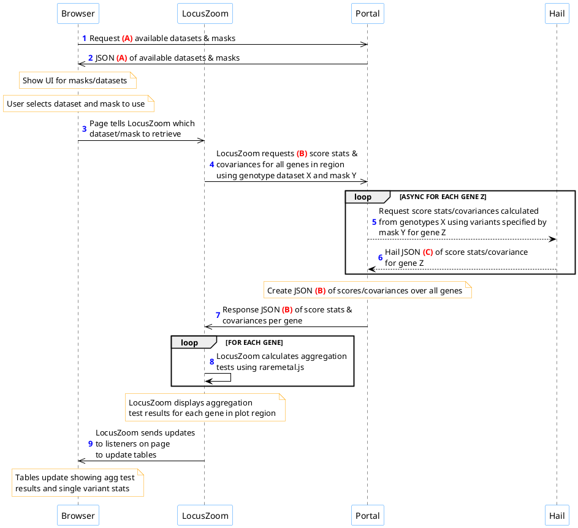

# Aggregation tests on the portal

## Outline

An outline of the process is below.

Request and response JSON formats:

* Request and response format A are under "**Retrieve available datasets/masks**" in our [proposal].
* Request and response format B are under "**Retrieve covariance in region given dataset/mask**" in our [proposal].
* HAIL JSON format C can be found [in this PDF.](https://gist.github.com/welchr/74e36d365ddc0b1095db68e43d4b0bdd#file-restserverspec-pdf)

## Proposed implementation targets

This is only a proposal for discussion. Fully expect dates and targets to move, especially considering other portal priorities and ASHG deadlines.

There are a few extra steps listed below. They are either background processing steps (like creating HAIL VDS formatted datasets), or splitting up tasks above into smaller workable units. This also makes it easier to discuss who could work on each part.

- [ ] **Select a trial genotype dataset/VCF and generate masks for it.** We can use this one dataset to later test the relevant APIs. *2018-XX-XX*.   

- [ ] **Implement portal metadata API**. This API (steps 1-2 above) tells the browser which genotype datasets are available to compute from, and what masks are defined for each. Only the one trial dataset and its masks would be available initially for testing. Corresponds to steps 1-2 above. See [proposal](https://github.com/statgen/raremetal.js/blob/master/docs/portal-api.pdf) for API. *2018-XX-XX*.   

- [ ] **Implement UI for selecting datasets/masks on portal page**. To start with, this UI could potentially be copied from the [aggregation test demo](http://statgen.github.io/locuszoom/examples/aggregation_tests.html). *2018-XX-XX*.   

- [ ] **Create a mock portal covariance API**. A quick API server endpoint or static JSON for one example region to use while testing. This would allow us to continue moving on other integration efforts without waiting for HAIL. Mocks out steps 4-7. *2018-XX-XX*.   

- [ ] **Implement LZ requesting covariance & executing aggregation tests using mock API**. An example of this can also be found in the [aggregation test demo](http://statgen.github.io/locuszoom/examples/aggregation_tests.html). *2018-XX-XX*.   

- [ ] **Convert the trial genotype dataset to HAIL VDS format.** HAIL requires a specific format for genotypes. *2018-XX-XX*.   

- [ ] **Implement portal covariance API.** This would cover steps 4-7 in the outline above. This is likely the the rate limiting step and most difficult to accomplish, and it also requires HAIL completing [additional features](#hail-targets). *2018-XX-XX*.   

- [ ] **Generate masks for all available genotype datasets.** Could start with a few simple masks to begin with. Should ask Mike/Goncalo/Jason what would make sense for this. *2018-XX-XX*.   

- [ ] **Convert all genotype datasets to HAIL VDS format.** And expose them to the portal covariance API. *2018-XX-XX*.   

- [ ] **Prototype available on portal test site.** *2018-XX-XX*.   

- [ ] **Deploy to production.** *2018-XX-XX*.

## HAIL targets

- [ ] Return allele frequencies in response (preferably ALT allele frequency).   
- [ ] Return single variant p-values in response.   
- [ ] Any additional development work that may be required (e.g. merging REST server code into master).

## Build this document

Grab [Atom](https://atom.io/) and the [markdown-preview-enhanced](https://atom.io/packages/markdown-preview-enhanced) extension. Then open this markdown document, and hit `CTRL+SHIFT+M` to activate the preview (or hit `CMD+SHIFT+P` to bring up the command palette, and type 'markdown preview', then select 'Markdown Preview Enhanced: Toggle').

Render to PDF or HTML by right-clicking in the preview pane.

[proposal]: https://github.com/statgen/raremetal.js/blob/master/docs/portal-api.pdf
